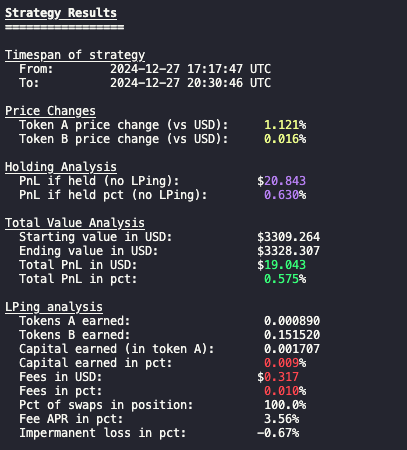

# Orca CLMM backtester

Series of articles going in-depth into the codebase, architecture and code structure:
1. [Data sync](https://substack.com/home/post/p-149385031)
2. [Simulator logic](https://substack.com/home/post/p-149664933)
3. Creating strategies (URL)

This README will cover on how to run the project and what it does high level. For details, read the substack articles.

The project is a full stack backtesting engine for Uniswap V3 forks. It supports both data syncing and simulating it after we initialize your provided strategy.
Currently, it only supports Orca, but its modular so other platforms can be added too. 

### What does this project do?
✅ Syncs transaction and liquidity data from ORCA. <br>
✅ Accurately simulates the swaps and liquidity transactions to calculate fees and price movement. <br>
✅ Allows you to create your own strategy on top of the backtester. <br>
✅ You can test three template strategies: NO_REBALANCE, SIMPLE_REBALANCE, VOLATILITY_REBALANCE. <br>
✅ Supports every pool from ORCA, regardless of how long it existed. <br>

### What does this project not do?
❌ It does not support EVM CLMMs or RAYDIUM, but they can be integrated. <br>
❌ Synthetic data has not been added to simulate all price paths. You will only test real historical data. <br>
❌ It does not support hyper realistic simulation for MEV strategies. The math for pricing and liquidity calculations falls in the 0.0001% range, so minor discrepencies exist. <br>

## Set up:

To be able to use the project you must have [rust installed](https://www.rust-lang.org/tools/install) in your system and it would be helpful to have the [postgres app](https://postgresapp.com/) to startup a postgres db.

Now you will first have to run the data sync which you can refer to below. But I recommend running with FALSE optimisation flag in env to sync maybe 100 transactions and then you can run the backtester. This will instantly show you results without syncing for a long time.

Afterwards for real testing run with TRUE optimisation flag, but beware it syncs from previous days midnight, so there is going to be a data gap that you will need to fill the next day by running the sync again. But if you have a strong internet connection (50 MBps+ stable) you can run the TRUE flag and sync months of data in hours.

Here is an example of a backtester results from syncing a couple of hours of transactions on SOL/USDC pool:


## Runnning the data sync:

To be able to run the data sync, you must fill out the env.

**ALCHEMY_API_KEY** and **COINGECKO_API_KEY** are standard api keys you need to get and fill out. 

**DATABASE_URL** is the postgres db URL which will give access to your created db.

**POOL_ADDRESS** is the pool address we want to sync.

**POOL_PLATFORM** is the platform to correctly determine from which CLMM to sync from (since different parsing logic exists)

**FEATURE_FLAG_OPTIMIZATION** is only for ORCA since they created storage end points for their transactions which we use.

**SYNC_DAYS** is the number of days you want to sync from the present to the past.

**SYNC_MODE** is the sync mode. There are three: FULL_RANGE, UPDATE, HISTORICAL. The full range will ignore your db state and just sync normally. The update will sync the gap of data from your latest transaction to the present moment (so if you didnt sync for 72h, just run update). The historical one will start syncing the number of days from your oldest transaction (ignoring your recently synced data).

Run the syncer with the following commmand: 
```cargo run sync```

## Runnning the backtester:

To be able to run the backtester, you must fill out the env. 

This backtester will run the data from the present up to the furthest point in the past. For now, no custom range option has been created.  <br>

Take into account that whatever amounts you give (in STRATEGY_DETAILS), should accurately reflect their pricing at the furthest point in time (that we are backtesting for). 

Also, whenever we create a position, we simulate a swap (impacting price and also deducting fees) so it remains as realistic as possible. Be mindful if you will swap literal millions in USD value since that will not represent reality. Since the price will be impacted within this pool, which could be arb'ed away in DEX<>CEX scenarios, but in our simulation that won't be the case. That will impact the range and the liquidity distribution you are providing at (making you earn too many fees, etc). <br>

**STRATEGY** asks for one of the three template options (or one of your own): NO_REBALANCE, SIMPLE_REBALANCE, VOLATILITY_REBALANCE.

**POOL_ADDRESS_TO_BACKTEST** asks for the pool address you will be running the backtest for. 

**STRATEGY_DETAILS** is a string that can contain anything relevant to your strategies. For instance, for NO_REBALANCE, we use upper_tick, lower_tick, token_a_amount and token_b_amount. For SIMPLE_REBALANCE we use token_a_amount, token_b_amount and range.

Run the backtester with the following commmand: 
```cargo run backtest```


